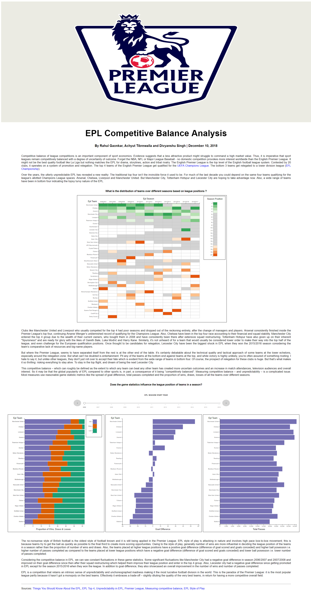

# EPL Competitive Balance Analysis

**Authors**: Rahul Purushottam Gaonkar (rpg283), Achyut Tibrewalla (at3617), Divyanshu Singh (ds5387)

Group 3 Online

## About
The English Premier League is the top level of the English football league system. Contested by 20 clubs, it operates on a system of promotion and relegation. The top 4 teams of the English Premier League get qualified for the UEFA Champions League. The bottom 3 teams get relegated to a lower division league (EFL Championship).  

The main goal of the project is to show how the distribution of teams changed based on league positions over different seasons and the game statistic metrics contributing to it. The project will try to convey how the traditional top 4 (Manchester United, Arsenal, Liverpool and Chelsea) and bottom 3 teams (relegated teams) changed over different seasons thereby emphasizing the competitive balance and unpredictability of EPL.

The project was divided into the following phases: 
***Problem definition and analytical questions:*** 
The goal was to create a set of insightful questions from the EPL dataset and transform these questions into tasks by identifying proxy values and developing proxy tasks 
***Data analysis and storyboarding:*** 
The main goal of this phase was to analyze data to find answers to the questions developed in the previous phase by generating an initial set of graphs using Tableau. In addition, an initial storyboard: which is a sequence of graphs and text that tell a story was also generated 
***Visualization design and development:*** 
The main goal of this phase is to refine and implement the story developed in the previous phase in a web page containing a title, explanatory text, and graphs developed in D3.js 
## More
[DEMO](https://rahulgaonkar.github.io/EPL-Competitive-Balance-Analysis/)

[Project Description](Report/Information_Visualization_Project_Proposal.pdf)
